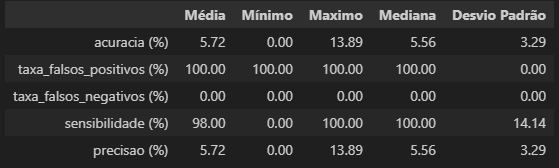
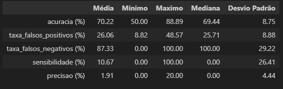

# Resultados observados

## Tabela 1: Desempenho sem PCA

Resultados da Atividade 2, utilizando os dados sem aplicação de PCA. Para os classificadores DMC, 1-NN e MaxCorr, foi selecionada a normalização que apresentou o melhor desempenho médio, no caso, sem normalização.

### Questão 1
**O que se pode concluir sobre os desempenhos dos classificadores avaliados?**

Os classificadores quadráticos (`Quadrático`, `Variante 2`, `Variante 3`, `Variante 4`) apresentaram, em sua maioria, um desempenho severamente comprometido, com acurácias próximas a um chute aleatório (≈6.67%). Isso ocorre devido ao número de atributos ser muito superior ao número de amostras por classe, tornando a estimativa da matriz de covariância instável.

Notavelmente, a **Variante 1 (Tikhonov)** foi a única exceção entre os modelos quadráticos, demonstrando que sua forma de regularização foi eficaz.

Em contrapartida, os classificadores que não dependem diretamente da inversão da matriz de covariância por classe, como **DMC**, **1-NN** e **MaxCorr**, mostraram-se muito mais robustos a este cenário, alcançando acurácias significativamente superiores e, em torno de 75% a 78%.

### Questão 2
**Qual deles teve o melhor desempenho em relação à taxa de acerto? E em relação ao tempo?**

Com base nos resultados da Tabela 1:
- **Taxa de Acerto:** O classificador com o melhor desempenho médio foi a **Variante 1 (Tikhonov)**.
- **Tempo de Execução:** O classificador mais eficiente computacionalmente foi o **MaxCorr**.

### Questão 3
**Houve problemas de inversão das matrizes de covariância? Se sim, para quais classificadores? Este problema foi contornado por alguma das variantes avaliadas? Se sim, descreva sucintamente o mecanismo usado para resolvê-lo.**

**Sim**, houve problemas de inversão de matriz. Conforme a coluna "Matrizes Singulares", o problema ocorreu  para o **Classificador Quadrático** e para a **Variante 4 (Naive Bayes)**.

Isso ocorre porque, sem regularização adequada, a estimativa da matriz de covariância ($C_i$) torna-se singular quando o número de atributos (p) é maior que o número de amostras por classe (n_c). Na implementação, a tentativa de inversão direta (`np.linalg.inv`) falha. Para que o algoritmo pudesse prosseguir e gerar um resultado, foi utilizado um fallback para a **pseudo-inversa (`np.linalg.pinv`)**, o que permitiu a conclusão do teste, ainda que com baixa acurácia.

As demais variantes contornaram o problema com sucesso através dos seguintes mecanismos de regularização:

- **Variante 1 (Tikhonov):** Adiciona um múltiplo da matriz identidade ($\lambda I_p$) à matriz de covariância ($C_i + \lambda I_p$), onde $0 \leq \lambda << 1$. Isso aumenta os valores da diagonal principal, tornando a matriz mais estável e garantindo sua invertibilidade.
- **Variante 2 (Pooled):** Utiliza uma única matriz de covariância agregada ($C_{pool}$), calculada como a média ponderada das covariâncias de todas as classes. Essa matriz é estimada com um número muito maior de amostras, tornando-a mais robusta e menos propensa à singularidade.
- **Variante 3 (Friedman):** Realiza uma combinação entre a matriz de covariância individual de cada classe ($C_i$) e a matriz agregada ($C_{pool}$).

## Tabela 2: Desempenho com PCA (Sem Redução)

Resultados da Atividade 4, com aplicação de PCA sem redução de dimensionalidade.

### Questão 4
**(i) O que se pode concluir sobre os desempenhos? Houve alguma mudança? (ii) O classificador quadrático e a Variante 4 tiveram desempenho equivalente?**

(i) A aplicação de PCA apenas para descorrelacionar os atributos  teve um impacto geral negativo no desempenho da maioria das variantes de regularização (Variantes 2 e 3). A estabilidade dessas variantes, que dependem da combinação de covariâncias, foi comprometida, como evidenciado pelo surgimento de matrizes singulares.

(ii) Sim, os classificadores Quadrático e Variante 4 (Naive Bayes) apresentaram desempenhos idênticos.

## Tabela 3: Desempenho com PCA (Com Redução)

### Questão 5
**Qual foi a dimensão de redução `q` escolhida, de modo a preservar 98% da informação?**

Com base no gráfico da variância explicada acumulada, o número de componentes principais (`q`) necessário para preservar pelo menos 98% da variância original dos dados é **q = 69**.

Resultados da Atividade 6, com aplicação de PCA com redução de dimensionalidade para `q=69`.

### Questão 6
**O que se pode concluir sobre os desempenhos com a realização da redução de dimensionalidade via PCA?**

A redução de dimensionalidade via PCA para `q=69` resultou em uma **melhora de desempenho substancial e generalizada**.
- **Melhora e Estabilidade:** Todass as variantes quadráticas tiveram um ganho de performance, com acurácias médias relativamente altas e a eliminação de matrizes singulares.
- **Eficiência:** Houve também uma redução significativa no tempo de execução dos modelos mais complexos, pois os cálculos matriciais foram realizados em um espaço de dimensão muito menor.
- **Piora Mínima:** Apenas o classificador **1-NN** apresentou uma leve queda no desempenho (de 78.18% para 77.09%). Isso pode ocorrer pois a redução, embora preserve a maior parte da variância, pode descartar informações sutis que eram úteis para a sua fronteira de decisão.

## Tabela 4: Desempenho com Box-Cox e PCA

### Questão 7
**Houve alguma mudança nos desempenhos com a aplicação da transformação BOX-COX juntamente com PCA?**

Sim, houve uma melhora geral no desempenho. Primeiramente, a aplicação da transformação Box-Cox antes do PCA resultou em uma representação de dados ainda mais compacta, reduzindo o número de componentes necessários para 98% de variância para **q = 63**.

Tabela com os resultados da Atividade 7, após aplicação da transformação Box-Cox e PCA com redução de dimensionalidade.

Observando a Tabela 4, a transformação Box-Cox trouxe um ganho adicional de acurácia para todos os classificadores, com exceção do Quadrático puro. A variante 3 foi a que apresentou o melhor resultado.

### Questão 8

- Índices de desempenho para o primeiro modelo:

- Índices de desempenho para o segundo modelo:

  
Podemos concluir que, após a aplicação de PCA para redução de dimensionalidade e normalização z-score, a classificação binária se demonstrou mais eficiente.

Ademais, é válido ressaltar que com outros indíviduos que não fossem o `16` (minhas fotos), o classificador apresentou um desempenho significativamente pior, provavelmente pelo fato de as images do dataset original terem um padrão de angulação, câmera e iluminação.

#### Comparando com outros indivíduos

A fim de exemplificar, abaixo está um exemplo aplicado a indentificar o indivíduo 12 como intruso:

- Índices de desempenho para o primeiro modelo (intruso = 12):

- Índices de desempenho para o segundo modelo (intruso = 12):

