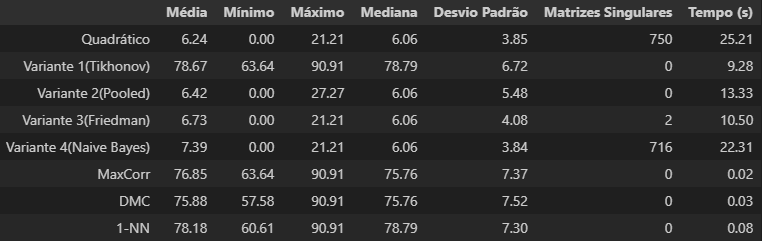
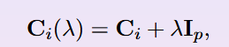
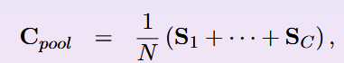
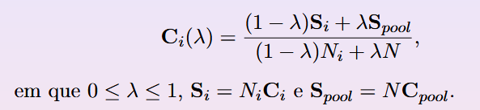
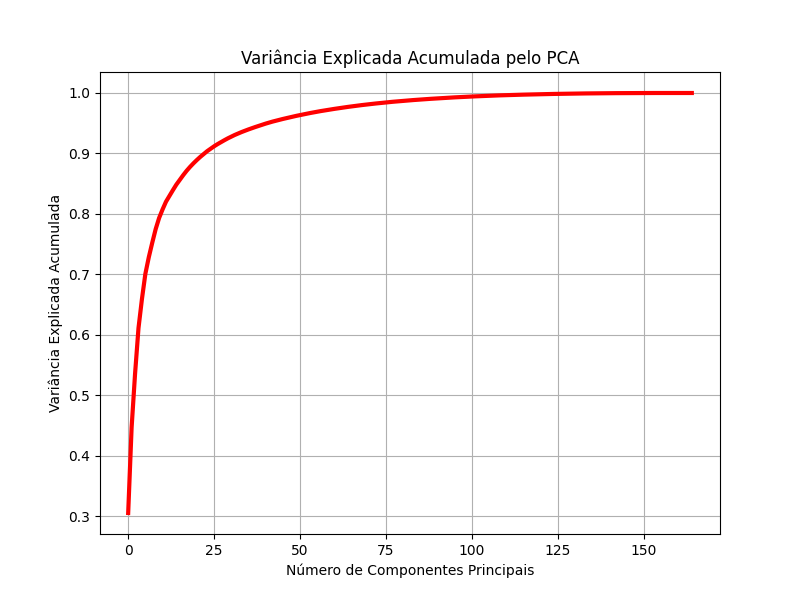
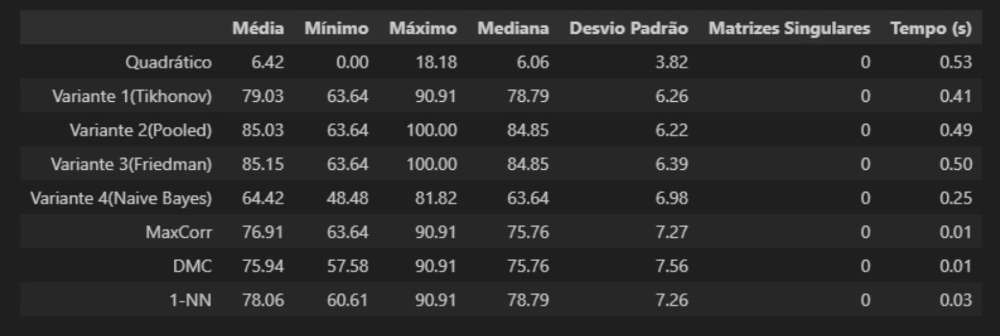

# Resultados observados

## Tabela 1

O modelo de normalização, utilizando a dimensão de [20 20] para redução das imagens, que apresentou melhores resultados foi o sem normalização, portanto a tabela 1 fica da seguinte maneira:

### Questão 1

Os classificadores baseados na matriz de covariância apresentaram desempenhos comprometidos, provavelmente devido ao grande número de atributos e poucos dados. Já os classificadores que não se baseiam nela, tiveram desempenhos melhores. 
### Questão 2

- Em relação à taxa de acerto: `Variante de Tikhonov`
- Em relação ao tempo: `MaxCorr`

### Questão 3

Sim, para o classificador quadratico default e para a variante 4 (Naive Bayes), o qual usa a matriz Ci,diag assumindo que os atributos são
descorrelacionados para aquela classe, ou seja, desconsidera
a informação provida pela correlação entre atributos. Nas demais variantes o problema foi contornado devido à regularização das matrizes de covariância. Sendo elas:

- Regularização Tikhonov

onde 0 < lambda << 1
- Regularização usando a matriz de convariancia agregada (Pooled)

- Regularização de Friedman

## Tabela 2

Tabela com PCA sem redução de dimensionalidade 

 23.45.18_5bb9b329.jpg>)

### Questão 4

- Houve uma piora das variantes 2, 3 e 4, além disso, a quantidade de matrizes singulares geradas também aumentou.
- Sim, ambos tiveram desempenho equivalente.

### Questão 5

Observando a imagem abaixo, foi escolhido o valor de q = 95

## Tabela 3

Tabela com aplicação de PCA para redução de dimensionalidade.

### Questão 6

Houve uma grande melhora no desempenho de quase todos os classificadores após a aplicação de PCA com q = 95, apenas o quadrático default ficando com desempenho ruim. Ademais, nenhuma matriz singular foi gerada e o tempo de execução diminuiu consideravalmente. Apenas o classificador 1-NN apresentou uma "piora" mínima, com seu valor médio saindo de 78.18% para 78.06%.

### Questão 7